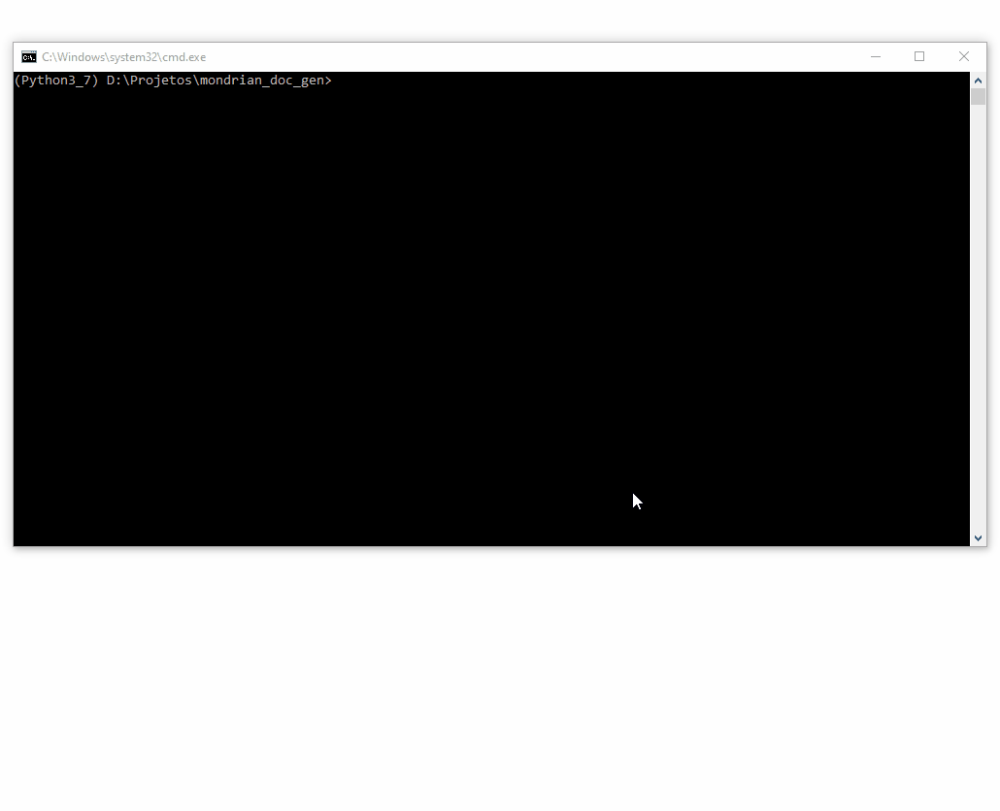

# Mondrian Cube Schema Documentation Generator

A command line utility based on Python that parses the schema definition for Mondrian cubes and generates a responsive HTML documentation based on the described metadata.

It reads the tables and columns definitions for cubes and dimensions and describe then using the `caption` and `description` tags inside each element to describe then in the documentation.



## Requirements

### Python Version
You need Python 3.5+ to run the tool.

### Libraries
You need to have the Python library `lxml` installed.

## Usage
The usage is rather simple, all you have to do is call the python script `mondrian_doc_gen.py` passing the following parameters:

### _--schema_file_, -s
The path to the Mondrian schema xml file.

### _--output_dir_, -o
The path to the directory where the documentation file will be recorded. The name of the documentation file will be documentation_\<schema file name without the extension\>.html.

### _--templates_dir_, -t
The path where the documentation templates are located. In this project there's a folder called `templates_html` contained the default ones. You may create your own templates if you need based on these.

Find below an example to create a documentation for the schema file `steelwheels.mondrian.xml` and outputting it to the `output` directory using the templates located at the **templates_html** folder:

`python mondrian_doc_gen.py -s "steelwheels.mondrian.xml" -o "output/" -t "templates_html/"`

## SELECT Builder

This tool also provides a way to generate a SELECT statement that will bring all the measures from a fact table along with all the dimension levels by using the information inside the specified Mondrian schema definition. For that, you have to call the script `sql_buider.py` passing the following parameters:

### _--schema_file_, -s
The path to the Mondrian schema xml file.

### _--cube_, -c
The name of the cube inside the schema definition (must match the `name` attribute inside the `Cube` xml tag).

Here's an example to generate a SELECT based on the `SteelWheelsSales` cube definition inside the `steelwheels.mondrian.xml` file.

`python sql_builder.py --schema_file "steelwheels.mondrian.xml" --cube "SteelWheelsSales"`

It will output a SELECT statement like this:

```
SELECT
    t.year_id
    , t.qtr_name
    , t.month_name
    , cwt.territory
    , cwt.country
    , cwt.state
    , cwt.city
    , cwt2.customername
    , p.productline
    , p.productvendor
    , p.productname
    , o.status
    , sum(o.quantityordered) AS quantityordered
    , sum(o.totalprice) AS totalprice
FROM
    orderfact o
JOIN
    time t ON
        t.time_id = o.time_id
JOIN
    customer_w_ter cwt ON
        cwt.customernumber = o.customernumber
JOIN
    customer_w_ter cwt2 ON
        cwt2.customernumber = o.customernumber
JOIN
    products p ON
        p.productcode = o.productcode

GROUP BY 1, 2, 3, 4, 5, 6, 7, 8, 9, 10, 11, 12
ORDER BY 1, 2, 3, 4, 5, 6, 7, 8, 9, 10, 11, 12
;
```

## Limitations
- The parser doesn't handle join clauses inside dimension definitions.
- Full dimension definitions inside cubes are not handled as well, only single column definitions and they are flagged as degenerated dimensions.
- Properties specific for **Pentaho Analyzer** are not considered.

## Possible improvements
- Output documentation as a markdown file.
- Better error handling.

## Credits

The bootstrap template used in this project was based on this [one](https://bootsnipp.com/snippets/7XqNK) created by the user [travislaynewilson](https://bootsnipp.com/travislaynewilson).
